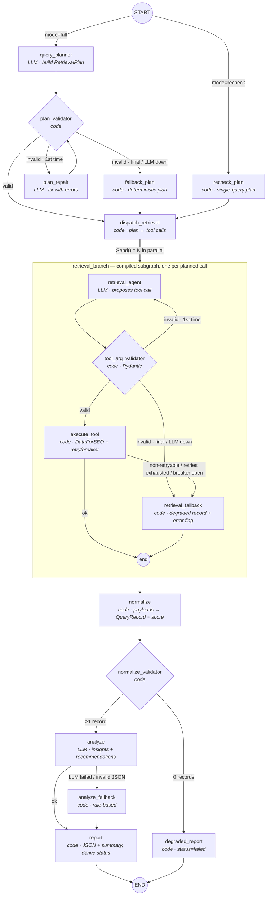

# Agentic Search Intelligence System

A production-minded **LangGraph DAG of single-responsibility agents** that answers questions like
*"How does Surfer SEO show up in AI answers and Google results for 'best SEO software'?"* — from query
planning, through DataForSEO retrieval with validated tool calls, to a structured report — exposed
through a **FastAPI** REST API with **SQLite persistence**, real **retry/backoff/circuit-breaker** resilience,
and **structured JSON logs + per-run traces + metrics**.

Every LLM call goes through an in-process **AI Gateway** (LiteLLM-based) that owns model routing per agent
role, provider fallback, retries, circuit breaking, response caching and token/cost accounting.

```
POST /api/v1/profiles → POST /api/v1/profiles/{uuid}/run → GET …/queries | …/recommendations | POST /api/v1/queries/{uuid}/recheck
```

---

## Table of contents

1. [Quick start](#1-quick-start)
2. [Architecture & DAG](#2-architecture--dag)
3. [Agent responsibilities](#3-agent-responsibilities)
4. [AI Gateway](#4-ai-gateway)
5. [Tool calling & argument validation](#5-tool-calling--argument-validation)
6. [DataForSEO integration (modes)](#6-dataforseo-integration)
7. [Failure handling & retries (with a simulated failure)](#7-failure-handling--retries)
8. [Observability (with log/trace excerpts)](#8-observability)
9. [REST API](#9-rest-api)
10. [Persistence model](#10-persistence-model)
11. [Opportunity score](#11-opportunity-score)
12. [Tests](#12-tests)
13. [Project structure](#13-project-structure)
14. [Known limitations & what I'd do next](#14-known-limitations--what-id-do-next)

---

## 1. Quick start

Requirements: [`uv`](https://docs.astral.sh/uv/) (it downloads Python 3.12 automatically). No API keys are
needed for the default **mock** DataForSEO mode; an `OPENAI_API_KEY` is needed for real LLM calls.

```bash
git clone <repo> && cd Assignment
cp .env.example .env            # add OPENAI_API_KEY=sk-... (everything else has working defaults)
uv sync                         # creates .venv with Python 3.12 + all deps
uv run main.py                  # → http://127.0.0.1:8000/docs   (single command to run)
uv run pytest -q                # 114 tests, fully offline (~10 s)
```

End-to-end demo without the HTTP server (creates the sample profile from the assessment, runs the DAG,
prints the report, queries, recommendations and metrics):

```bash
uv run scripts/demo_run.py --recheck              # mock DataForSEO + real OpenAI
uv run scripts/demo_run.py --fake-llm --recheck   # fully offline (scripted role-aware fake LLM)
uv run scripts/demo_run.py --fake-llm --chaos     # inject API failures → watch retries, breaker, fallbacks
```

`make run | test | lint | demo | demo-chaos | diagram | docker-up` wrap the same commands (the host used for
development is Windows without `make`, so every target is documented as a plain `uv run …` command).

Docker: `docker compose up --build` (reads `.env`, persists SQLite in a named volume).

### Configuration (`.env.example`)

| Variable | Default | Purpose |
|---|---|---|
| `OPENAI_API_KEY` / `ANTHROPIC_API_KEY` / `GEMINI_API_KEY` | – | Provider keys. Fallback models whose provider has no key are dropped at startup. |
| `GATEWAY_<ROLE>_MODEL` / `_FALLBACKS` | `openai/gpt-4o-mini`, analyst `openai/gpt-4o` | Per-agent-role routing; LiteLLM `provider/model` ids. |
| `GATEWAY_TIMEOUT_S`, `GATEWAY_MAX_RETRIES`, `GATEWAY_CACHE_*`, `GATEWAY_BREAKER_*` | 30 s, 2, on/600 s, 5/30 s | Gateway resilience knobs. |
| `DATAFORSEO_MODE` | `mock` | `mock` (fixtures, zero keys) · `live` (real API) · `chaos` (fixtures + injected failures). |
| `DATAFORSEO_LOGIN` / `_PASSWORD` | – | Required for `live`. |
| `DATAFORSEO_*_TIMEOUT_S`, `DATAFORSEO_MAX_ATTEMPTS`, `DATAFORSEO_RETRY_*`, `DATAFORSEO_BREAKER_*` | 5 s/30 s, 4, 0.5→8 s, 5/30 s | Timeouts, backoff and breaker for the DataForSEO client. |
| `DATAFORSEO_CHAOS_SCRIPT` | `serp_organic:429,429,ok;…` | Per-tool outcome sequence for chaos mode (`ok`, HTTP code, `timeout`, `network`, `malformed`). |
| `PIPELINE_MAX_CONCURRENCY`, `PIPELINE_RECURSION_LIMIT` | 4, 60 | Parallel retrieval branches; LangGraph step cap. |
| `DATABASE_URL` | `sqlite:///./search_intel.db` | Any SQLAlchemy URL (Postgres works unchanged). |
| `LOG_LEVEL`, `LOG_FORMAT` | `INFO`, `json` | `console` gives human-readable logs for local dev. |

---

## 2. Architecture & DAG

```
 HTTP (FastAPI) ──► PipelineService ──► compiled LangGraph ──► persist run / queries / recs / traces (SQLAlchemy)
                                             │
                                  every node wrapped by @traced_node (JSON log + NodeTrace + metrics)
                                             │
                     LLM nodes ──► AI Gateway (LiteLLM: routing, fallback, retry, breaker, cache, usage)
                     tool node ──► DataForSEOClient (mock | live | chaos transport; retry, breaker, timeouts)
```

The graph is an explicit `StateGraph` with named nodes, conditional edges, a **map/fan-out** (`Send`) into a
**compiled retrieval subgraph** (one instance per planned tool call, run in parallel) and a fan-in into
normalization. Fallback nodes exist at every stage, so the run degrades instead of crashing.



`uv run python -m scripts.diagram` prints the diagram LangGraph itself generates from the compiled graph
(`graph.get_graph(xray=1).draw_mermaid()`), which is what the test-suite asserts against.

**Design choices worth calling out**

* **Retrieval branch as a subgraph.** With a multi-node branch, parallel branches finish in different
  LangGraph "supersteps" and a plain fan-in node fires several times. Compiling the branch as one node makes
  all `Send`s complete in one superstep, so `normalize` runs exactly once. The subgraph declares an
  `output_schema` containing only reducer-backed keys (`raw_results`, `api_calls`, `llm_usage`, `node_traces`,
  `errors`, `degradation`) so N branches merge without `InvalidUpdateError`.
* **TypedDict state, Pydantic values.** `Send` payloads are plain dicts, so the state schema is a TypedDict
  while every value (plan, records, analysis, report) is a validated Pydantic model.
* **Bounded repair loops.** `plan_validator → plan_repair` runs at most once, `tool_arg_validator →
  retrieval_agent` at most once per branch; counters in state guarantee termination and every other failure
  routes *forward* to a fallback node.
* **Nodes never touch the database.** `PipelineService` persists after `graph.invoke()` returns — this
  sidesteps SQLite cross-thread session issues under LangGraph's thread-pool fan-out.
* **Retries live in `execute_tool`, not LangGraph's `RetryPolicy`,** because the node-level policy cannot
  distinguish a 429 from a 401 or surface retry counts into traces.
* **Status derivation** (`report`): `failed` = zero usable records; `partial` = any degraded branch, fallback
  plan, dropped records or rule-based analysis; otherwise `completed`. `report_json.degradation[]` lists
  every reason so the API consumer knows *why* a run is partial.

---

## 3. Agent responsibilities

Each node does exactly one job. LLM nodes only *decide*; code nodes only *validate/transform/route*.

| Node | Kind | Sole responsibility |
|---|---|---|
| `query_planner` | LLM (role `planner`) | Turn profile + question into a `RetrievalPlan` (4–8 sub-queries with intent, priority, `wants_ai_check`). Structured output validated against the Pydantic schema. |
| `plan_validator` | code | Business rules: 2–8 distinct queries, length bounds, must include a brand query. Routes valid / repair / fallback. |
| `plan_repair` | LLM | One retry of the planner with the validation errors appended. |
| `fallback_plan` | code | Deterministic plan from profile fields (brand, "best {industry} software", comparisons vs competitors) when the LLM is unusable. |
| `recheck_plan` | code | One-query plan for `POST /queries/{uuid}/recheck`. |
| `dispatch_retrieval` | code | Expand plan → `PlannedCall`s: 1× `serp_organic` per query, 1× `llm_responses` where `wants_ai_check`, **one batched** `keyword_volume` call. Fans out with `Send`. |
| `retrieval_agent` | LLM (role `retrieval`) | Given one planned step and all three tool schemas, **propose** exactly one tool call with arguments. Never summarises. |
| `tool_arg_validator` | code | Check the proposed tool matches the plan, parse/validate arguments with Pydantic (`extra="forbid"`), fill only *missing* keys from safe profile defaults. Never raises. |
| `execute_tool` | code | Execute the validated call through `DataForSEOClient` (timeouts, exponential backoff + jitter, circuit breaker). Emits `RawResult` + `ApiCallRecord`. |
| `retrieval_fallback` | code | Emit a clearly flagged degraded `RawResult` so downstream nodes still run. |
| `normalize` | code | Deterministic parsers: SERP positions/AI-Overview citations, LLM-answer citations, volumes → `QueryRecord` with `competitive_difficulty` and `opportunity_score`. Drops queries with zero usable sources. |
| `normalize_validator` | code | Route: records → `analyze`; none → `degraded_report`. |
| `analyze` | LLM (role `analyst`) | Reason over scored records → `AnalysisResult` (insights with relevance scores, content recommendations). Output is **grounded**: query texts snapped to real records, scores copied from code, unmatched items dropped. |
| `analyze_fallback` | code | Rule-based insights/recommendations when the analyst LLM fails. |
| `report` | code (+ LLM role `reporter` for prose only) | Assemble the final JSON report, derive status/degradation, produce a human-readable summary (deterministic template; LLM polish is optional). |
| `degraded_report` | code | `status=failed` report with the error inventory. |

---

## 4. AI Gateway

`app/gateway/` is the **only** place that talks to an LLM provider. Agents call
`gateway.complete(role=…, messages=…, tools=…, response_model=…, run_id=…)` and get back a normalised
`LLMResponse` (text, parsed tool calls, parsed structured object, usage, model used, attempts, fallback flag).

```
complete(role) ─► route = routes[role]  (primary model + fallback chain, temperature, timeout, max_retries)
              ─► cache lookup (sha256 of model+messages+tools+schema; temperature-0 requests only)
              ─► for model in chain:
                     skip if circuit OPEN
                     provider.complete() with tenacity (exp backoff + full jitter) on ProviderRetryable
                     ProviderNonRetryable (401/400/policy) → next model immediately
                     structured output → Pydantic validate → ONE repair round-trip → else next model
              ─► usage → UsageLedger (per run) + MetricsRegistry; response cached
              ─► AllProvidersFailed(errors_by_model) if nothing worked → callers route to fallback nodes
```

* **Provider adapter:** `LiteLLMProvider` calls `litellm.completion()` directly (OpenAI tool-call wire format,
  which LiteLLM normalises for Anthropic/Gemini/…), maps LiteLLM exceptions into retryable/non-retryable,
  extracts usage and `completion_cost`. `litellm` is imported lazily and with
  `LITELLM_LOCAL_MODEL_COST_MAP=True` (otherwise it fetches the cost map over the network at import time).
  `langchain-litellm`'s `ChatLiteLLM` was deliberately *not* used — its tool-calling support is beta with open
  issues, and the gateway needs to own the retry/fallback loop anyway.
* **Adding a provider is configuration:** set `ANTHROPIC_API_KEY` and put `anthropic/claude-…` in a
  `GATEWAY_*_FALLBACKS` list.
* **Testing:** `FakeProvider` scripts responses/exceptions per model; the gateway tests cover routing, retry
  counts, fallback order, breaker skipping, cache hits, structured-output repair and ledger totals without
  importing LiteLLM.

---

## 5. Tool calling & argument validation

One tool per DataForSEO endpoint, each a Pydantic model whose JSON schema is what the LLM sees
(`app/tools/schemas.py`, `app/tools/registry.py`):

| Tool | Endpoint | Arguments |
|---|---|---|
| `serp_organic` | `POST /v3/serp/google/organic/live/advanced` | `keyword` (1–200), `location_code=2840`, `language_code="en"`, `device`, `depth` (10–100, step 10) |
| `llm_responses` | `POST /v3/ai_optimization/chat_gpt/llm_responses/live` | `user_prompt` (1–500), `model_name`, `web_search=true`, `max_output_tokens` |
| `keyword_volume` | `POST /v3/keywords_data/google_ads/search_volume/live` | `keywords` (1–1000, deduped/trimmed), `location_code`, `language_code` |

The LLM decides the call; **code validates before anything is executed** (`validate_tool_call`, never raises):

* `arguments` may arrive as a dict, a JSON string, malformed JSON, a non-object, or be missing → each becomes
  a readable error, not an exception.
* `extra="forbid"` rejects hallucinated fields; bounds reject `depth=7`, empty keywords, >1000 keywords.
* Missing keys are filled **only** from safe defaults (profile location/language, the planned keyword) so a
  partial call can still run; explicit LLM values are never overwritten.
* A rejected proposal is sent back to the LLM once with the exact Pydantic errors; a second rejection routes
  to `retrieval_fallback` (the run becomes `partial`, never crashes).

---

## 6. DataForSEO integration

`DATAFORSEO_MODE` selects the transport behind the same `DataForSEOClient`:

| Mode | What happens | Used for |
|---|---|---|
| **`mock`** (default) | Deterministic fixtures generated from the keyword hash, shaped exactly like the real envelope (`tasks[].result[].items[]`, `ai_overview.references`, `url_citation` annotations). The profile domain and competitors are injected at realistic positions. | Graders/CI: zero credentials, reproducible. **This is the mode used for all tests and the demo output in this README.** |
| **`live`** | `httpx.Client` with basic auth, `connect=5s / read=30s` timeouts, HTTP + task-level (`tasks[0].status_code`) error classification. | Real data. Verified against the documented request/response shapes and covered by `respx` tests; not exercised against the paid API during this assessment. |
| **`chaos`** | Mock transport wrapped with a per-tool outcome script (`serp_organic:429,429,ok;llm_responses:500,…;keyword_volume:timeout,ok`). | Demonstrating retries, breaker and fallbacks; the failure tests. |

---

## 7. Failure handling & retries

**Classification** (`app/resilience/errors.py`, shared by the DataForSEO client and the gateway):

| Retryable → backoff | Non-retryable → fail fast |
|---|---|
| timeouts, connection errors, HTTP 408/429/5xx, DataForSEO task codes 402xx (limits) and 5xxxx, LLM rate-limit/overload/connection errors | HTTP 400/401/403/404, malformed bodies, DataForSEO 4xxxx (bad request/auth), LLM auth/bad-request/content-policy/context-window, open circuit |

**Retry** (`call_with_retry`): tenacity `stop_after_attempt(DATAFORSEO_MAX_ATTEMPTS=4)` +
`wait_random_exponential(0.5 → 8 s)` (exponential with full jitter), only on `RetryableError`; retry count is
returned to the caller and lands in the node trace and logs.

**Circuit breaker** (bonus): per tool endpoint and per LLM model — CLOSED → OPEN after 5 consecutive
failures → HALF-OPEN after 30 s (single probe) → CLOSED on success. Open circuits fail instantly with
`CircuitOpenError` (non-retryable) so a dead dependency doesn't burn the whole retry budget on every branch.

**Graceful degradation:** every failure has a forward path — `fallback_plan`, `retrieval_fallback`,
`analyze_fallback`, `degraded_report` — and the run ends `partial`/`failed` with `degradation[]` explaining why.

### Simulated failure (real output)

```bash
uv run scripts/demo_run.py --fake-llm --chaos \
  "serp_organic:429,503,ok;llm_responses:500,500,500,500,500,500,500,500,500,500,500,500;keyword_volume:timeout,ok"
```

What happened (abridged JSON logs from that run; every line shares the same `run_id`):

```json
{"event":"dataforseo.call_failed","tool":"serp_organic","http_status":429,"retryable":true,"node":"execute_tool","branch":"2b8836c4","run_id":"d791f433-…","level":"warning"}
{"event":"dataforseo.retry","tool":"serp_organic","attempt":1,"sleep_s":0.13,"error":"HTTP 429: …","node":"execute_tool","branch":"2b8836c4","run_id":"d791f433-…"}
{"event":"dataforseo.call_failed","tool":"serp_organic","http_status":503,"retryable":true,"node":"execute_tool","branch":"a6cf5550","run_id":"d791f433-…"}
{"event":"dataforseo.retry","tool":"serp_organic","attempt":1,"sleep_s":0.49,"node":"execute_tool","branch":"a6cf5550","run_id":"d791f433-…"}
{"event":"node.end","node":"execute_tool","status":"success","retry_count":1,"api_calls":2,"branch":"2b8836c4","run_id":"d791f433-…"}
{"event":"dataforseo.call_failed","tool":"llm_responses","http_status":500,"retryable":true,"node":"execute_tool","branch":"0d9e9ab2","run_id":"d791f433-…"}
{"event":"dataforseo.retry","tool":"llm_responses","attempt":3,"sleep_s":1.73,"node":"execute_tool","branch":"0d9e9ab2","run_id":"d791f433-…"}
{"event":"dataforseo.call_failed","tool":"llm_responses","retryable":false,"error":"circuit 'llm_responses' is open","node":"execute_tool","branch":"51c0e2aa","run_id":"d791f433-…","level":"error"}
{"event":"node.end","node":"retrieval_fallback","status":"degraded","error":"llm_responses failed (breaker_open): circuit 'llm_responses' is open","branch":"51c0e2aa","run_id":"d791f433-…"}
{"event":"run.summary","status":"partial","planned_calls":8,"records":4,"api_calls":8,"llm_calls":11,"total_tokens":1590,"degradation":["llm_responses[best seo software]: llm_responses failed (breaker_open): …", "…"],"run_id":"d791f433-…"}
```

* The two `serp_organic` transient errors (429, 503) were **retried with jittered backoff and recovered**
  (`retry_count=1`, `api_calls=2` on those `execute_tool` traces).
* `llm_responses` kept returning 500: the first branch exhausted its 4 attempts, the breaker tripped after 5
  consecutive failures, and the remaining AI-check branches **short-circuited into `retrieval_fallback`**
  instead of hammering the dependency.
* The run still produced **4 normalised records, insights and recommendations**, and finished with
  `status="partial"`; the affected queries carry `error_flag=true` / `visibility unknown for AI answers`, and
  `degradation[]` names each cause. Nothing crashed.

The same scenarios are asserted in `tests/test_graph_failure_fallback.py` and `tests/test_dataforseo_client.py`
(transient → recovered; exhausted → fallback + partial; 401 → fail fast; all tools down → `failed`;
malformed payload → flagged; planner/analyst/reporter LLM failures → their fallbacks; bad tool args → repair
then fallback).

---

## 8. Observability

**Structured JSON logs (structlog).** Every node is wrapped by `@traced_node`, which emits `node.start` /
`node.end` with duration, status, retry count, API-call count, tokens, a **redacted** input summary
(`api_key|password|authorization|…token` masked, long strings truncated) and an output summary. Correlation
fields are bound via contextvars and appear on every line inside the scope: `request_id` (from/for
`X-Request-ID`), `run_id`, `profile_uuid`, `mode`, `node`, `branch`. LangGraph's thread pool copies
contextvars, so parallel branches keep their correlation ids.

```json
{"event":"node.start","node":"query_planner","input":{"mode":"full","question":"How does Surfer SEO…","profile":{"domain":"surferseo.com","competitors":3}},"request_id":"f4ae5800…","run_id":"168a2634-…","component":"graph","level":"info","timestamp":"2026-09-06T08:14:59.653Z"}
{"event":"llm.call","role":"planner","model":"openai/gpt-4o-mini","attempts":1,"fallback_used":false,"tokens":300,"cost_usd":0.0001,"latency_ms":812.4,"tool_calls":[],"run_id":"168a2634-…","node":"query_planner"}
{"event":"node.end","node":"query_planner","status":"success","duration_ms":815.1,"retry_count":0,"api_calls":0,"tokens":300,"output":{"plan":"RetrievalPlan","plan_source":"llm","plan_errors_count":0},"run_id":"168a2634-…"}
{"event":"node.end","node":"tool_arg_validator","status":"success","output":{"validation_errors_count":0,"validated_tool":"serp_organic","validated_args":"dict"},"branch":"c0907f01","run_id":"168a2634-…"}
{"event":"node.end","node":"execute_tool","status":"success","duration_ms":4.0,"retry_count":0,"api_calls":1,"output":{"exec_ok":true,"raw_results_count":1},"branch":"c0907f01","run_id":"168a2634-…"}
{"event":"run.summary","status":"completed","planned_calls":8,"records":4,"api_calls":8,"llm_calls":11,"total_tokens":1590,"cost_usd":0.0011,"duration_ms":85,"metrics":{"nodes":{"execute_tool":{"count":8,"success":8,"latency_ms_avg":3.1,"latency_ms_p95":8.5}},"api_calls":{"serp_organic":{"ok":4,"total":4}},"llm_calls":{"planner:openai/gpt-4o-mini":{"count":1,"tokens":300}}},"run_id":"168a2634-…"}
```

**Traces.** The same `NodeTrace` records are persisted as `node_executions`, so a run can be followed
node-by-node after the fact: `GET /api/v1/runs/{run_uuid}/trace` returns the ordered list (node, branch,
status, duration, retries, API calls, tokens, redacted input/output summaries, error).

**Metrics.** `MetricsRegistry` (in-memory, thread-safe) keeps per-node count/success/failure/avg/p95/max
latency, API calls per tool per outcome (`ok`, `retryable_error`, `non_retryable_error`, `breaker_open`), LLM
calls per role/model with tokens, and run outcomes. A snapshot is logged in `run.summary` at the end of every
run and exposed at `GET /api/v1/metrics` together with the gateway's usage ledger and breaker states.

**What I would add for production**

* OpenTelemetry: one span per node (child spans for LLM and DataForSEO calls), `trace_id` propagated from
  the HTTP request; export to Tempo/Jaeger/Honeycomb. The `@traced_node` decorator is the single place to add it.
* Optional LangSmith tracing (`LANGCHAIN_TRACING_V2`) for prompt/response inspection of the LLM nodes.
* Prometheus exporter for the metrics registry (histograms instead of in-memory percentiles), plus SLO alerts:
  `partial`-rate, breaker-open events, p95 node latency, DataForSEO error rate, cost per run.
* Log shipping (JSON already) with sampling for `node.start`; persistent audit of LLM prompts/outputs behind
  a redaction policy; dashboards keyed by `run_id` and `profile_uuid`.

---

## 9. REST API

Interactive docs at `/docs`. No auth (out of scope). All responses are JSON; validation errors are `422`
with `{"error":"validation_error","detail":[…]}`; unknown ids are `404`.

```bash
# 1. register a profile  → 201
curl -s -X POST localhost:8000/api/v1/profiles -H 'content-type: application/json' -d '{
  "name": "Surfer SEO", "domain": "surferseo.com", "industry": "SEO Software",
  "description": "AI-powered SEO content optimization tool",
  "competitors": ["clearscope.io", "marketmuse.com", "frase.io"] }'
# {"profile_uuid":"…","name":"Surfer SEO","domain":"surferseo.com","status":"created","created_at":"…"}

# 2. run the DAG (synchronous, 10–30 s with real providers) → 200; `status` = completed | partial | failed
curl -s -X POST localhost:8000/api/v1/profiles/$P/run -H 'content-type: application/json' \
     -d '{"question": "How does Surfer SEO show up in AI answers for best SEO software?"}'
# {"run_uuid":"…","status":"completed","planned_calls_count":8,"records_extracted_count":4,
#  "top_insights":[{"query_text":"surfer seo vs clearscope","headline":"…","relevance_score":0.8,"opportunity_score":0.72}],
#  "report":{"json":{…},"summary":"…"},"total_tokens":1590,"total_cost_usd":0.0011,"degradation":[],…}

# 3. profile + stats (total runs, most recent run status, average opportunity score, …)
curl -s localhost:8000/api/v1/profiles/$P

# 4. queries of the most recent run, sorted by opportunity_score desc; filters + pagination
curl -s "localhost:8000/api/v1/profiles/$P/queries?min_score=0.5&status=not_visible&page=1&per_page=20"
# {"items":[{"query_uuid":"…","query_text":"…","estimated_search_volume":1466,"competitive_difficulty":61,
#            "opportunity_score":0.7192,"domain_visible":false,"visibility_position":null,"discovered_at":"…",…}],
#  "page":1,"per_page":20,"total":3}

# 5. recommendations (analysis agent → report agent)
curl -s localhost:8000/api/v1/profiles/$P/recommendations
# [{"recommendation_uuid":"…","target_query_uuid":"…","content_type":"comparison","title":"…","rationale":"…",
#   "target_keywords":["…"],"priority":"high",…}]

# 6. re-run retrieval → normalization → analysis for ONE query
curl -s -X POST localhost:8000/api/v1/queries/$Q/recheck
# {"run":{…"mode":"recheck","planned_calls_count":3…},"query":{…updated record…},"recommendations":[…]}

# observability extras
curl -s localhost:8000/api/v1/runs/$R            # run summary
curl -s localhost:8000/api/v1/runs/$R/trace      # node-by-node trace
curl -s localhost:8000/api/v1/profiles/$P/runs   # run history
curl -s localhost:8000/api/v1/metrics            # in-memory metrics + LLM usage + breaker states
```

Status-code policy: `/run` and `/recheck` return **200 with `status` inside** — `partial` and `failed` are
legitimate pipeline outcomes that were persisted and can be inspected; `500` is reserved for genuine
unhandled errors, and even then the run row is marked `failed` with the error text instead of staying
`running`. "Most recent run" for `/queries` and `/recommendations` means the latest **full** run plus any
rechecks since (a recheck updates one query in place rather than hiding the rest).

---

## 10. Persistence model

SQLAlchemy 2.x (`app/db/models.py`); `Base.metadata.create_all` at startup (Alembic deliberately skipped — see limitations).

```
profiles ──< pipeline_runs ──< node_executions          (trace: seq, node, branch, status, duration, retries, api_calls, tokens, summaries)
    │              └──────────< recommendations >── queries
    └──────────< queries   (unique per profile+query_text; upserted each run, last_run_id / last_checked_at updated)
```

* `pipeline_runs`: mode (`full|recheck`), status, question, counts (planned calls, records, API calls, LLM
  calls), `total_tokens`, `total_cost_usd`, `report_json`, `summary`, `degradation`, `error`, timings.
* `queries`: the fields required by the spec (`query_text`, `estimated_search_volume`, `competitive_difficulty`,
  `opportunity_score`, `domain_visible`, `visibility_position`, `discovered_at`) plus `visibility_status`,
  `ai_cited`, `competitor_positions`, `score_components`, `error_flag/error_detail`, `last_checked_at`.
* `recommendations`: replaced wholesale by a full run; a recheck replaces only those targeting that query.

---

## 11. Opportunity score

Computed in code (`app/services/scoring.py`), never by the LLM, and every component is stored so the score is auditable:

```
vol_norm       = clamp(log10(1 + search_volume) / log10(1 + 100_000), 0, 1)         (unknown → 0.3)
difficulty     = clamp(0.6·competition_index + 0.4·min(competitors_in_top10, 5)·20, 0, 100)   → competitive_difficulty
visibility_gap = 1.0 if not visible · clamp((position−1)/20, 0, 1)·0.5 if visible · 0.6 if unknown
ai_gap         = 1.0 if not cited in AI answers · 0.2 if cited · 0.6 if unknown
opportunity    = 0.35·vol_norm + 0.25·(1 − difficulty/100) + 0.25·visibility_gap + 0.15·ai_gap     ∈ [0, 1]
```

High-volume, low-difficulty queries where the brand is absent from both Google and AI answers score highest.

---

## 12. Tests

`uv run pytest -q` — **114 tests, all offline** (mock/chaos DataForSEO, scripted fake LLM, zero backoff delays, in-memory SQLite).

| File | Covers |
|---|---|
| `test_tool_validation.py` | Tool schemas → OpenAI definitions; valid/partial/malformed/hallucinated/out-of-range/unknown-tool arguments **(required: tool-call argument validation)** |
| `test_resilience.py` | HTTP classification table, retry-until-success with retry counts, fail-fast on non-retryable, exhaustion, jitter bounds, breaker state machine |
| `test_dataforseo_client.py` | Mock realism + determinism, chaos retry/exhaustion/401/breaker/malformed, task-level status codes, live transport via `respx` (basic auth, body, 429/401/timeout) |
| `test_parsers.py`, `test_scoring.py`, `test_logging.py` | Deterministic extraction, score properties, secret redaction + context propagation |
| `test_gateway.py` | Routing, retries, fallback chain, `AllProvidersFailed`, breaker skip, cache, structured-output repair, schema injection, key-aware config |
| `test_graph_happy_path.py` | **Required happy path**: completed run, planned-call arithmetic, records/insights/report, traces for every agent and no fallbacks, per-role usage, metrics, Mermaid contains all nodes, recheck mode |
| `test_graph_failure_fallback.py` | **Required simulated API failure with retry/fallback**: transient errors retried → completed; exhausted → `retrieval_fallback` + `partial`; 401 fast-fail; all tools down → `degraded_report`/`failed`; malformed payload; planner down/garbage/invalid → fallback/repair; bad tool args repaired once / persistently bad → fallback; wrong tool rejected; analyst/reporter failures |
| `test_api.py` | 201/404/422 semantics, run response fields, stats, sorting/filters/pagination, upsert on re-run, recommendations linkage, recheck, trace + metrics endpoints, chaos through the API |

---

## 13. Project structure

```
main.py                     single-command server entry point (uvicorn)
app/
  config.py                 pydantic-settings (every knob in .env.example)
  api/                      FastAPI factory, routers (profiles, queries, runs/metrics), schemas, serializers
  services/                 pipeline_service (run graph → persist), scoring
  graph/                    state (TypedDict + reducers), builder (DAG + retrieval subgraph), deps, tracing, prompts
    nodes/                  planner · retrieval · normalize · analyze · report  (one file per stage)
  gateway/                  AI gateway: config, gateway, cache, usage ledger, errors, providers/ (litellm, fake)
  tools/                    Pydantic tool schemas + registry/validation
  dataforseo/               client (mock | live | chaos transports), mock_data, parsers, domain helpers
  resilience/               error taxonomy, retry (tenacity), circuit breaker
  observability/            structlog JSON config + redaction, metrics registry
  db/                       SQLAlchemy engine/session, models, repositories
tests/                      114 offline tests (+ fakes.py: role-aware scripted LLM)
scripts/                    demo_run.py (end-to-end demo, chaos flag), diagram.py
Dockerfile, docker-compose.yml, Makefile, .env.example
```

---

## 14. Known limitations & what I'd do next

* **Live DataForSEO not exercised against the paid API.** The live transport is implemented and tested
  with `respx` against the documented shapes; mock mode is the default. First step with credentials: run
  `DATAFORSEO_MODE=live uv run scripts/demo_run.py` and tighten the parsers for any field drift, and confirm
  which 402xx task codes DataForSEO uses for rate limits (currently 40202/40210 + all 5xxxx are retryable).
* **Synchronous `/run`.** Acceptable per the brief; for production I'd enqueue runs (Celery/RQ/arq), return
  `202 {run_uuid, status: running}` and let clients poll `GET /runs/{uuid}` (the run row and status machine
  already support this).
* **Schema migrations.** `create_all` at startup; add Alembic once the schema stabilises.
* **Single process metrics/cache/breakers.** In-memory by design for the assessment; move breakers and the
  response cache to Redis for multi-instance deployments and export metrics to Prometheus.
* **Mock realism.** Fixtures are deterministic and plausible but simplified (no SERP features beyond organic +
  AI Overview; volumes are synthetic).
* **Recheck scope.** Re-runs retrieval/normalization/analysis for one query and regenerates only that
  query's recommendations; cross-query insights are not recomputed.
* **Prompt evaluation.** No eval harness for planner/analyst quality yet; I'd add a small golden set and an
  LLM-as-judge check in CI, plus prompt versioning in the gateway ledger.
* **Auth/multi-tenancy** are out of scope per the brief; the resource model (profile-scoped everything) is ready for it.

**Time spent:** ~6.5 h. Trade-offs made consciously: SQLite over Postgres (zero-config for reviewers),
TypedDict state over Pydantic state (LangGraph `Send` semantics), `litellm.completion` over `ChatLiteLLM`
(tool-calling reliability + gateway ownership of retries), deterministic scoring/normalisation over LLM
judgement (auditability), and a deterministic report summary with optional LLM polish (never fails on prose).
